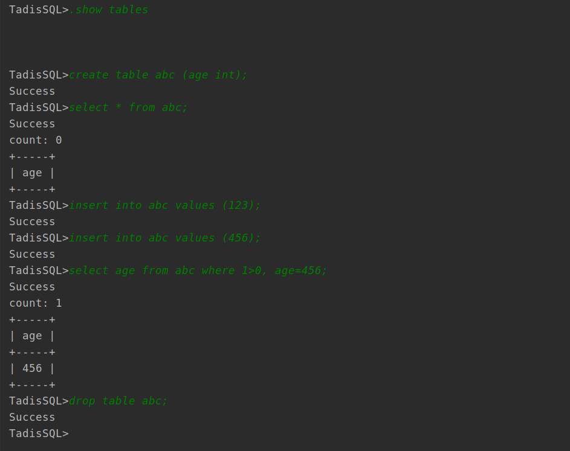

# Tadis - A simple relational database


## Table of Contents

- [Instaroduction](#Introduction)
- [Install](#Install)
- [Usage](#Usage)
- [Contributing](#contributing)
- [License](#license)

## Introduction
 Tadis is a relational database and it's my personal project.
 This system was developed for educational purposes and should not be used in production environments.
 Tadis supports poor SQL's grammers.

## Install
  Make sure your computer already installed the [boost library](https://www.boost.org/)
  
  ### Linux

  ```
  > git clone https://github.com/Haibarapink/tadis.git
  > cd tadis
  > mkdir build && cd build
  > cmake ../
  > make 
  ```
  ...

## Usage
### SQL 
* Create table example
```
CREATE TABLE school (name varchar(200), age int);
```
Tadis supports these SQL datatypes: VARCHAR(size), CHAR(size), FLOAT, INT.

* Insert example 
```
INSERT INTO school VALUES ('AAU', 55);
```

* Delete example
```
DELETE * FROM school;
DELETE FROM school;
DELETE FROM school WHERE school.name='HKU';
```
* Select example
```
SELECT * FROM school;
SELECT school.name , school.age FROM SCHOOL where age=100; 
```